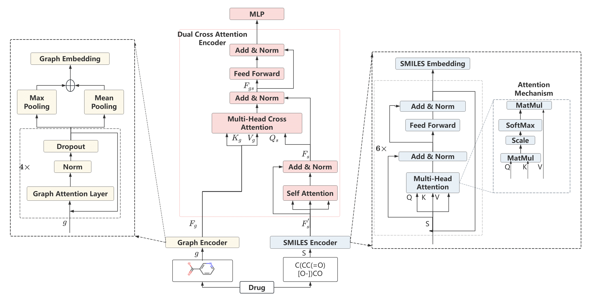

# DMCA Model Training




This repository provides scripts for preprocessing molecular datasets and training a model using the **DMCA** framework.

## Installation

   ```bash
   # create a new environment
   $ conda create --name DMCA python=3.7
   $ conda activate molclr
   
   # install requirements
   $ pip install torch==1.13.1+cu117 torchvision==0.14.1
   $ pip install torch-geometric==2.3.1 torch-sparse== 0.6.17+pt113cu117 torch-scatter==2.1.1+pt113cu117
   ```

## Dataset Preparation

1. Download the dataset from [MoleculeNet](https://moleculenet.org/datasets-1).
2. Preprocess the dataset by running the following command:

   ```bash
   python In_memory_dataset_whole_SMILE.py --dataset ${dataset}
   ```

## Model Training
After preprocessing, train the model using:

```bash
python train_DMCA.py --dataset ${dataset} --batch_size ${batch_size} --epochs ${epoch_number} --n_tasks ${n_task} --random_seed ${random_seed}

--dataset: Name of the dataset to be used.
--batch_size: Batch size for training.
--epochs: Number of training epochs.
--n_tasks: Number of tasks for multi-task learning.
--random_seed: Random seed for reproducibility.


